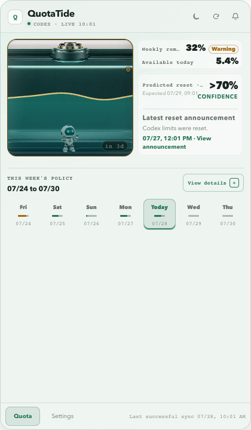
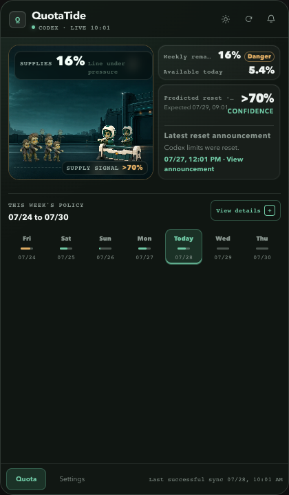

<p align="center">
  
</p>

<h1 align="center">QuotaTide</h1>

<p align="center">
  <strong>把 Codex 七日额度，变成一眼可懂的桌面潮汐。</strong><br>
  <em>See your seven-day Codex quota at a glance.</em>
</p>

<p align="center">
  
  
  
  <a href="LICENSE"></a>
</p>

QuotaTide 是一款独立开源的 macOS / Windows 托盘应用。它在本机只读访问一个
Codex 账号，展示当前七日额度窗口、动态每日预算、消耗压力和重置信号。

QuotaTide is an independent, open-source macOS and Windows tray app. It reads
one local Codex account and turns the active seven-day quota window, dynamic
daily budget, burn pressure, and reset signals into a compact desktop view.

Author / 作者：TheBlind · License / 许可证：[MIT](LICENSE) · Application ID /
应用标识：`dev.theblind.quotatide`

> QuotaTide is not affiliated with or endorsed by OpenAI. Codex and OpenAI are
> trademarks of their respective owners.
>
> QuotaTide 与 OpenAI 没有官方关系，也未获得其背书。Codex 和 OpenAI 是其
> 各自所有者的商标。

## Screenshots / 界面预览

| 潮汐压力舱 · Rising Water | 最后补给线 · Last Supply Line |
| --- | --- |
|  |  |
| 水位、角色状态和颜色随额度压力变化 | 用补给与围城距离呈现同一组额度数据 |

> 截图由内置预览场景生成，不包含真实账号或令牌。Screenshots use built-in
> preview data and contain no real account or token information.

## Highlights / 主要功能

| | 功能 | What it does |
| --- | --- | --- |
| **📊** | **当前七日窗口**：展示周剩余、今天还可用、精确重置时间和窗口内七个自然日；不是滚动的“最近七天”。 | Shows the active seven-day window, remaining quota, today's allowance, exact reset time, and all seven calendar dates. |
| **🌊** | **可视化压力**：潮汐压力舱和最后补给线两套主题会随安全、提醒、危险、临界和恢复状态变化。 | Two visual stories react to safe, warning, danger, critical, and recovery states. |
| **📈** | **消耗预测**：用稳健速率估算重置前用量与可能耗尽时间，并展示只读重置次数状态。 | Projects usage at reset and likely exhaustion time with a robust burn rate, plus read-only reset-credit status. |
| **🗓️** | **动态每日预算**：可编辑七天基础额度、策略时区和工作日未用额度结转。 | Supports editable daily limits, policy timezone, and weekday carry-forward. |
| **🔔** | **多通道提醒**：每小时后台刷新，可按阈值发送系统通知或可选的 TLS SMTP 邮件。 | Refreshes hourly and delivers threshold alerts through native notifications or optional TLS SMTP email. |
| **📡** | **重置雷达**：并列呈现 Codex 本机观测与第三方公开重置信号，不把预测伪装成官方事实。 | Keeps local Codex observations separate from third-party public reset estimates. |
| **🖥️** | **托盘优先**：常驻菜单栏 / 任务栏，托盘文字可配置，并支持开机启动、浅色与深色外观。 | Lives in the tray with configurable text, autostart, and light/dark appearance. |
| **🔒** | **本地优先**：`auth.json` 始终只读；历史保存在本地 SQLite，秘密存入系统凭证库，并支持脱敏诊断、恢复和本地数据清除。 | Keeps `auth.json` read-only, stores history locally, protects secrets with the OS vault, and provides redacted diagnostics and recovery tools. |
| **🌐** | **双语与安全更新**：支持简体中文、英文及跟随系统；更新需用户确认并通过 Tauri 签名验证。 | Supports Chinese, English, and system language, with explicit signature-verified updates. |

## Preview distribution / 预览版分发

The `0.x` direct-download builds are unsigned previews:

- macOS: one universal DMG for Apple Silicon and Intel, minimum macOS 15.0.
- Windows: one x64 current-user NSIS installer for Windows 11 25H2+, using the
  Evergreen WebView2 bootstrapper.
- No MSI, per-machine installer, fixed WebView2 runtime, telemetry service, or
  browser/server edition is distributed.

`0.x` 直接下载版本属于未签名预览版：

- macOS：同一个 universal DMG 支持 Apple Silicon 与 Intel，最低 macOS 15.0。
- Windows：Windows 11 25H2+ x64 当前用户 NSIS 安装包，使用 Evergreen
  WebView2 bootstrapper。
- 不提供 MSI、全机器安装、fixed WebView2 runtime、遥测服务或浏览器/服务器版。

Gatekeeper or SmartScreen can warn because this project currently has no
Developer ID or Authenticode publisher certificate. Do not globally disable
operating-system protections. Follow the scoped steps and verify SHA-256 in:

由于项目目前没有 Developer ID 或 Authenticode 发布者证书，Gatekeeper 或
SmartScreen 可能提示风险。请勿全局关闭系统保护；请按文档进行单应用确认并
校验 SHA-256：

- [Install, update, and uninstall (English)](docs/en/install-update-uninstall.md)
- [安装、更新与卸载（简体中文）](docs/zh-CN/install-update-uninstall.md)
- [Release verification (English)](docs/en/release-verification.md)
- [发布校验（简体中文）](docs/zh-CN/release-verification.md)

Production release generation is intentionally blocked until the public GitHub
repository and final updater public key are bound. The committed key is a
development-only key whose private half was destroyed. Even after binding,
public publishing is allowed only through the audited
[release-evidence gate](docs/qa/README.md).

在公开 GitHub 仓库与最终 updater 公钥确认前，生产发布门禁会按设计失败。仓库
当前提交的仅是开发公钥，其私钥已销毁，不能用于正式发布。完成绑定后也只能
通过[发布证据门禁](docs/qa/README.md)公开发布。

## Privacy and security / 隐私与安全

- [Privacy (English)](docs/en/privacy.md)
- [隐私说明（简体中文）](docs/zh-CN/privacy.md)
- [Security policy / 安全策略](SECURITY.md)
- [Third-party notices / 第三方声明](THIRD_PARTY_NOTICES.md)

## Development / 开发

Requirements: Rust 1.88.0, Node.js 22.13+, Xcode Command Line Tools on macOS,
Microsoft C++ Build Tools and WebView2 on Windows, Tauri CLI 2.11.4, and
cargo-deny 0.20.2.

```bash
npm --prefix ui ci
cargo fmt --all --check
cargo clippy --workspace --all-targets --all-features -- -D warnings
cargo test --workspace
cargo deny check
npm --prefix ui run check
npm run check
git diff --exit-code -- ui/src/bindings
```

Run the desktop app:

```bash
cargo tauri dev
```

The old Node server, Docker image, browser page, plaintext SMTP environment
path, and legacy database have been removed. Node remains only as the Tauri
frontend and deterministic release-tool runtime.

旧 Node 服务、Docker 镜像、浏览器页面、明文 SMTP 环境变量入口和旧数据库均
已移除。Node 仅用于 Tauri 前端和确定性的发布工具。

See [CONTRIBUTING.md](CONTRIBUTING.md) for contribution and release-boundary
rules.
