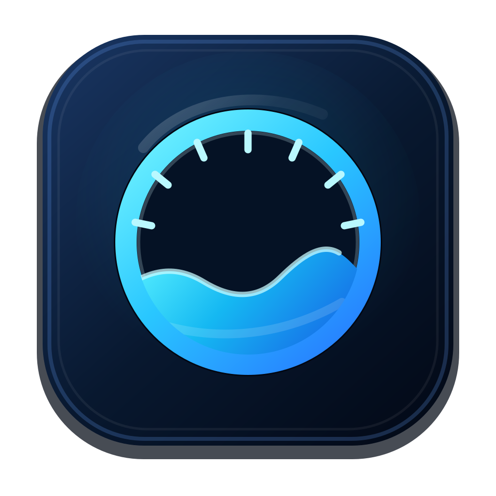
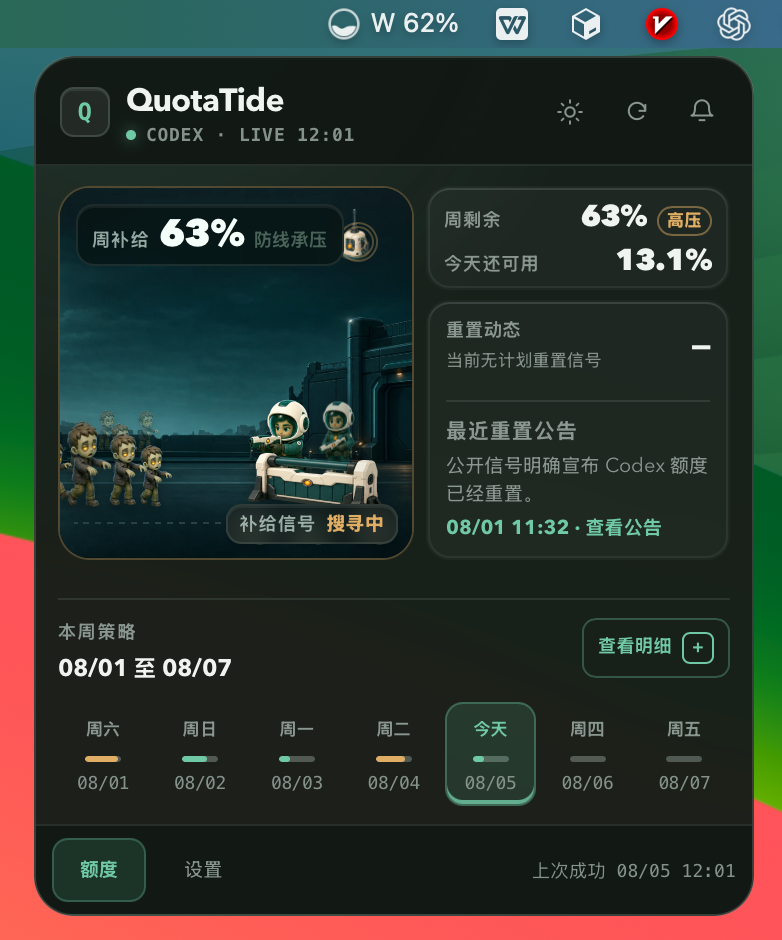

<p align="center">
  
</p>

<h1 align="center">QuotaTide</h1>

<p align="center">
  <strong>把 Codex 七日额度，变成一眼可懂的桌面潮汐。</strong><br>
  <em>See your seven-day Codex quota at a glance.</em>
</p>

<p align="center">
  
  
  
  <a href="LICENSE"></a>
</p>

<p align="center">
  
</p>

QuotaTide 是一款本地优先的 macOS / Windows 托盘应用，只读监控一个 Codex
账号当前的七日额度窗口。截图使用内置预览数据，不包含真实账号或令牌。

QuotaTide is a local-first macOS and Windows tray app for one Codex account.
Screenshots use built-in preview data and contain no real account information.

## 主要功能 / Highlights

- **额度总览 / Quota overview** — 周剩余、今日可用、七日明细与精确重置时间。
- **压力预测 / Burn projection** — 动态预算、工作日结转、消耗速率与耗尽预测。
- **额度叙事 / Quota story** — 最后补给线随额度压力实时变化。
- **提醒 / Alerts** — 每小时刷新、原生通知、TLS SMTP 邮件与重置雷达。
- **托盘优先 / Tray first** — 菜单栏 / 任务栏常驻、可配置显示与开机启动。
- **本地隐私 / Local privacy** — `auth.json` 始终只读；SQLite 历史、系统凭证库、脱敏诊断与恢复工具均留在本机。
- **双语更新 / Bilingual updates** — 简体中文、英文、跟随系统及签名验证更新。

## 安装 / Install

`0.x` 为未签名预览版：macOS 15+ universal DMG；Windows 11 25H2+ x64
当前用户安装包。Gatekeeper / SmartScreen 可能提示风险，请勿全局关闭系统保护。

- [macOS / Windows 安装、更新与卸载](docs/zh-CN/install-update-uninstall.md)
- [Install, update, and uninstall](docs/en/install-update-uninstall.md)
- [发布校验](docs/zh-CN/release-verification.md) · [Release verification](docs/en/release-verification.md)

## 开发 / Development

需要 Rust 1.88.0、Node.js 22.13+、Tauri CLI 2.11.4，以及对应平台的系统构建工具。

```bash
npm --prefix ui ci
cargo tauri dev
```

提交前检查：

```bash
cargo fmt --all --check
cargo clippy --workspace --all-targets --all-features -- -D warnings
cargo test --workspace
cargo deny check
npm --prefix ui run check
npm run check
git diff --exit-code -- ui/src/bindings
```

[隐私说明](docs/zh-CN/privacy.md) · [Privacy](docs/en/privacy.md) ·
[安全策略](SECURITY.md) · [第三方声明](THIRD_PARTY_NOTICES.md) ·
[参与贡献](CONTRIBUTING.md)

Author / 作者：TheBlind · Application ID：`dev.theblind.quotatide`

> QuotaTide 与 OpenAI 没有官方关系，也未获得其背书。QuotaTide is not
> affiliated with or endorsed by OpenAI.
