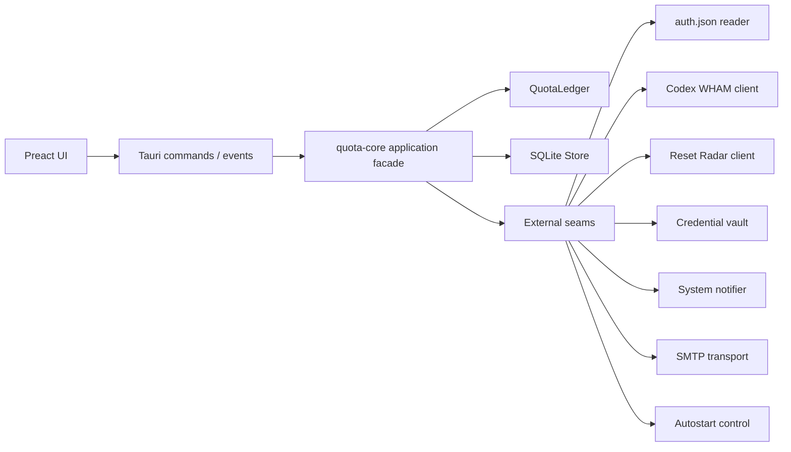
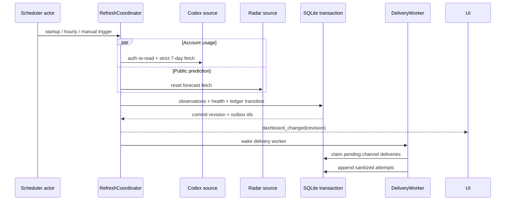

# Rust 桌面应用架构

> 状态：v1 实施基线
>
> 日期：2026-07-28
>
> 关联：[技术栈](./desktop-stack.md) · [平台集成](./platform-integrations.md) ·
> [上游契约](./upstream-contracts.md) · [托盘窗口原型](./tray-window-ui.md)

## 结论

v1 使用三层工作区，而不是把每项能力拆成独立 crate：

```text
/
├── Cargo.toml                 # Rust workspace
├── crates/
│   └── quota-core/            # 领域、用例、SQLite store；不知道 Tauri/WebView
├── src-tauri/                 # Tauri 壳、生产 adapters、进程组合根
└── ui/                        # Vite + Preact + TypeScript
```

- `quota-core` 是深模块：它拥有额度账本、刷新协调、设置提交、告警 outbox、
  查询投影和 SQLite schema。它不能依赖 Tauri、WebView、系统通知、keyring
  或 SMTP 的具体实现。
- `src-tauri` 是薄适配层：它实现文件读取、Codex/Radar HTTP、系统凭证库、
  通知、SMTP、开机启动、托盘和窗口行为，并把安全 DTO 暴露为 Tauri
  commands。
- `ui` 只保存 `DashboardDto` 和尚未提交的 `SettingsDraft`。它不计算额度、
  不读取文件、不直接访问 SQLite 或网络，也不持有 access token、账号 ID
  或 SMTP 密码的回显值。

旧 Node/Docker 项目不做逐文件翻译。新应用按已经确认的行为契约重新实现，
通过同一组场景测试证明行为一致；开源前删除 legacy 服务、Docker 配置和
旧运行时依赖。

## 设计原则

### 依赖方向

所有依赖只向领域与用例收敛：



`quota-core` 定义外部 seam 所需的 trait；`src-tauri` 提供生产 adapter。
只有在存在真实外部所有者，或至少两个真实实现时才引入 trait。SQLite 是
本进程可替换的实现细节，测试直接使用同一 store 的内存数据库，不创建一套
只为 mock 而存在的 repository trait。

### 固定数值与时间

- 领域内不用 `f64` 累加额度。`QuotaUnits(i64)` 以百万分之一个百分点存储，
  `100% = 100_000_000`；上游浮点值只在 adapter 边界转换一次。
- 所有瞬时点以 UTC 整数时间戳存储；自然日按配置的 IANA 时区通过
  `chrono` + `chrono-tz` 计算。
- 策略是带 `effective_at` 的 `PolicyRevision`。修改只影响今天和未来，
  已完成日期仍引用当日生效的 revision。
- 每个账号流由稳定的 account identity 隔离。quota epoch 只能由账户自身的
  604800 秒窗口事实确认；第三方雷达预测不能开启或关闭 epoch。

## 深模块与公开接口

下面的接口是设计形状，不要求实施时逐字采用相同 Rust 语法。接口外行为和
不变量必须保持。

### 1. `QuotaLedger`

`QuotaLedger` 是纯内存领域模块，隐藏 epoch、高水位、逐日 delta、动态结转、
阈值跨越和预测状态的全部规则。

```rust
pub struct QuotaLedger;

impl QuotaLedger {
    pub fn apply(
        state: LedgerState,
        observation: UsageObservation,
        policy: &PolicyTimeline,
        now: DateTime<Utc>,
    ) -> Result<LedgerTransition, LedgerError>;

    pub fn project(
        state: &LedgerState,
        policy: &PolicyTimeline,
        now: DateTime<Utc>,
    ) -> DashboardFacts;
}
```

`LedgerTransition` 同时返回新的状态、需要追加的不可变事实和
`AlertCandidate`，但不写数据库、不发通知。关键不变量：

- current window 必须严格为 604800 秒。
- 同一 stream 的 `used` 只取高水位；微小回退不会改写历史。
- 只有已确认新窗口才能建立新 epoch；`reset_at` 文本变化本身不足以确认。
- 动态额度只重算今天及之后；过去日期的使用和上限保持原样。
- 结转额度只能在策略允许的目标日之间分配，七日可用总量不得超过 100%。
- 所有阈值由“上次已持久化状态 -> 本次状态”的跨越产生，不由 UI 猜测。

这是纯模块，因此用表驱动测试和属性测试直接覆盖接口，不为它创建 adapter。

### 2. `RefreshCoordinator`

这是应用层最深的模块，对外只有一次刷新请求：

```rust
pub trait RefreshService {
    async fn refresh(&self, trigger: RefreshTrigger)
        -> Result<RefreshReceipt, PublicError>;
}
```

它隐藏：

- single-flight、每小时调度和手动刷新 30 秒冷却；
- 每轮重新只读打开 `auth.json`；
- Codex 与 Radar 的并发请求和独立健康状态；
- 401/403 时仅在磁盘 token 已变化的前提下重试一次；
- `QuotaLedger` 计算、SQLite 原子事务、last-known-good 和 outbox 写入；
- 提交后的 dashboard revision 通知。

它依赖四个外部 seam：

```rust
trait AuthMaterialSource {
    async fn read_current(&self) -> Result<AuthMaterial, SourceError>;
}

trait CodexUsageSource {
    async fn fetch_current(
        &self,
        auth: &AuthMaterial,
    ) -> Result<UsageObservation, SourceError>;
}

trait ResetRadarSource {
    async fn fetch_prediction(&self) -> Result<RadarObservation, SourceError>;
}

trait Clock {
    fn now(&self) -> DateTime<Utc>;
}
```

生产实现分别是只读文件、固定 origin 的 WHAM HTTP、固定 origin 的 Radar
HTTP 和系统时钟。测试使用内存 source 与 fake clock。任何 trait 都不得把
`reqwest::Error`、文件原文或 token 暴露给用例层。

### 3. `SettingsManager`

`SettingsManager` 把“表单提交”变成一个原子用户操作：

```rust
pub trait SettingsService {
    async fn get_public(&self) -> Result<PublicSettings, PublicError>;
    async fn validate(&self, draft: SettingsDraft)
        -> Result<SettingsValidation, PublicError>;
    async fn commit(
        &self,
        draft: SettingsDraft,
        secret: SecretUpdate,
    ) -> Result<SettingsCommit, PublicError>;
}
```

它隐藏路径规范化、策略校验、SMTP 地址解析、凭证库两阶段更新、开机启动
同步和失败回滚。密码更新必须是明确的 `Keep | Set | Delete`，返回 DTO 永远
不能包含密码或“可恢复的掩码”。进入 Rust 后立即用 `secrecy`/`zeroize`
包装并在使用后清零。

外部 seam 只有：

```rust
trait CredentialVault { /* get / set / delete app-scoped secret */ }
trait AutostartControl { /* query / enable / disable */ }
```

文件选择器属于 Tauri 壳。它只返回用户明确选择的候选路径，之后仍由
`SettingsManager` 做只读验证；WebView 不获得通用文件系统权限。

### 4. `DeliveryWorker`

告警创建和投递必须解耦。`QuotaLedger` 只产生候选事件，SQLite 事务用稳定的
`AlertKey` 去重并写入 outbox；`DeliveryWorker` 在事务提交后独立投递：

```rust
pub trait DeliveryService {
    async fn deliver_pending(&self) -> DeliverySweep;
    async fn send_test_email(&self) -> Result<TestDelivery, PublicError>;
}
```

它依赖：

```rust
trait SystemNotifier { async fn notify(&self, message: SafeNotification); }
trait MailTransport { async fn send(&self, message: SafeMail); }
```

系统通知和邮件分别记录状态，一个渠道失败不能撤销另一个渠道的成功。
重试复用相同 `AlertKey + channel`，不会创建第二条用户告警。测试邮件是显式
用户操作，不进入额度告警 outbox，但必须经过同样的输入校验、超时和错误脱敏。

生产 SMTP 使用复用的
[`lettre::AsyncSmtpTransport<Tokio1Executor>`](https://docs.rs/lettre/latest/lettre/transport/smtp/struct.AsyncSmtpTransport.html)
与 `tokio1-rustls`，只允许 TLS relay 或 STARTTLS；禁用明文 SMTP。

### 5. `AppQuery`

查询模块从同一 SQLite store 生成只读投影：

```rust
pub trait AppQuery {
    async fn dashboard(&self) -> Result<DashboardDto, PublicError>;
    async fn settings(&self) -> Result<PublicSettingsDto, PublicError>;
}
```

`DashboardDto` 已经包含七个精确日期、每天的使用/上限/状态、周窗口、
新鲜度、来源健康、重置预测和当前提醒摘要。UI 只能格式化，不得再次实现策略。

### 6. `Application`

`Application` 是 Tauri 唯一看到的 facade。它组合 `AppQuery`、
`RefreshCoordinator`、`SettingsManager` 和 `DeliveryWorker`，但不暴露它们
的 adapter 或 SQLite handle。`src-tauri` 在进程启动时创建一个 `Arc<Application>`
并注册为 managed state。

## 异步运行模型

Tauri 自带的 Tokio runtime 是唯一 async runtime。另有一个
`tokio-rusqlite` 连接线程；不为每次刷新、每封邮件或每条 SQL 新建线程。



### Scheduler actor

- 启动后立即刷新一次，之后每小时一次。
- 使用 `tokio::time::interval` 与 `MissedTickBehavior::Skip`，唤醒恢复后不补跑
  一串过期任务。
- actor 串行拥有刷新状态。刷新中到达的定时或手动请求加入当前结果的 waiter，
  不再排队启动第二轮。
- 手动刷新冷却在 actor 内执行，不能由重启 UI 或直接调用 IPC 绕过。
- `auth.json` 路径或网络相关设置成功提交后可触发一次刷新；仍受
  single-flight 合并。
- 进程退出通过 cancellation token 停止 scheduler 和 delivery worker；
  不因后台任务而阻止 Tauri 正常退出。

Codex 与 Radar 在一轮内并发，但结果相互独立。Radar 失败不能丢弃成功的账户
额度，账户失败也不能抹掉最后一次成功额度。两种来源的健康状态和观测结果在
一笔 SQLite 事务中提交，使 dashboard revision 始终指向自洽快照。

## SQLite 所有权与事实模型

使用一个由 `tokio-rusqlite` 管理的 SQLite 连接：

- `Connection::call` 把闭包发送到单独连接线程且异步返回；handle 可廉价 clone，
  同一连接上的调用自然串行化，符合本应用低写入量的事务模型。
- 测试用同一实现的 `open_in_memory()`，避免 mock repository 与真实 SQL
  行为分叉。参见
  [`tokio-rusqlite` 设计说明](https://docs.rs/tokio-rusqlite/latest/tokio_rusqlite/)。
- 生产启用 `foreign_keys=ON`、合理 `busy_timeout` 和 WAL；schema 只通过
  前向 migration 变更。
- WebView 没有 SQL plugin 或数据库路径访问权。

存储区分“不可变事实”和“可重建状态”：

| 类别 | 示例 | 规则 |
|---|---|---|
| 不可变事实 | usage/radar observations、policy revisions、alert events、delivery attempts | 只追加，诊断与重建依据 |
| 当前状态 | stream high-water、active epoch、source health、settings pointer | 只能与对应事实在同一事务更新 |
| 可重建投影 | daily usage、dashboard revision、pending delivery view | 可从事实与 policy timeline 重建 |

具体 schema、非秘密设置的落盘位置、迁移版本和诊断保留规则由后续
“配置、状态与安全模型”决策给出。无论最终 schema 如何，必须满足：

- 每个自然日引用当时生效的 policy revision，修改策略不会改写过去。
- `AlertKey` 有唯一约束，至少包含 stream/epoch、自然日或窗口、事件种类和
  阈值。
- 投递尝试不保存 SMTP 密码、access token、完整 auth 内容或上游原始错误体。
- 快照可长期保存；按每小时单账号写入，其规模不需要激进清理。

## Tauri IPC 与 UI 状态

Tauri adapter 暴露以下窄 commands：

```text
get_dashboard
get_settings
refresh_now
validate_settings
save_settings
select_auth_file
send_test_email
```

开机启动随 `save_settings` 原子提交，不另设可绕过设置校验的公共命令。
退出只能来自原生托盘菜单，不暴露给任意 WebView 脚本。

在完整 `SettingsDraft` 所依赖的通知、邮件、凭证库与开机启动能力尚未进入实现
里程碑时，允许阶段性暴露与当前 ticket 同范围的窄 mutation command（例如
`update_quota_policy`）。它仍须执行完整字段替换、乐观 revision 校验，并发送
revision-only `settings_changed` / `dashboard_changed` 事件；正式 v1 合并设置页
时必须收敛进上述 `save_settings` 原子提交，不能作为第二条长期写入路径保留。

所有 command 返回 Rust 定义的 serde DTO 或结构化 `PublicError`：

```text
PublicError {
  code: stable enum,
  message_key: localized key,
  safe_context: allowlisted values only
}
```

内部使用 `thiserror` 保留错误链，日志通过 `tracing` 输出脱敏字段；不能把
`anyhow`/`reqwest`/keyring 的原始字符串跨 IPC。Rust DTO 使用
[`ts-rs`](https://docs.rs/ts-rs/latest/ts_rs/) 在测试时生成 TypeScript
bindings；CI 在生成后检查工作区无 diff，阻止 Rust/TS 合约漂移。

Rust 只发送小型事件 `dashboard_changed { revision }` 和
`settings_changed { revision }`。UI 收到后重新调用查询 command；窗口每次
显示时也重新查询，避免隐藏期间漏掉事件。额度数据量很小，不使用 streaming
channel，也不在 UI 设置轮询器。

Tauri 官方 command 支持 async、managed state 和结构化 serde 返回值，适合
这套 facade；参见
[Calling Rust from the Frontend](https://v2.tauri.app/develop/calling-rust/)。

## 前端选择

使用 Vite + Preact + TypeScript：

- Preact 提供完整 TypeScript 类型且官方建议从 Vite 开始；
  参见 [Preact TypeScript](https://preactjs.com/guide/v10/typescript/) 和
  [Getting Started](https://preactjs.com/guide/v10/getting-started/)。
- v1 不引入 router、全局状态库、signals、图表库或远程字体。窗口只有
  `overview/settings` 两种内部状态，`useReducer`/`useState` 足够。
- 七日图表使用语义 HTML、CSS 和本地 SVG；所有资产随安装包发布。
- 组件样式只消费平台玻璃层提供的透明度变量；不支持玻璃时使用已确认的
  不透明 surface tokens。
- Content Security Policy 默认 `self`，不授予通用 HTTP、shell 或文件系统
  能力。只有列出的 commands 能触达 Rust。

UI 的唯一持久状态是 Rust 返回的数据；输入表单在保存前是局部 draft。
SMTP 密码输入保存成功后立即清空，重新打开设置只显示“已配置/未配置”。

## 告警与 outbox

领域层只创建下列稳定事件：

- 当日使用跨过当日动态上限的 80% 或 100%；
- 周额度剩余跨过 20% 或 10%；
- Radar 的 24 小时重置概率首次跨过 70%；
- 账户来源确认进入新 quota epoch；
- 同一来源连续失败达到 3 次。

事件的“首次跨过”以持久化状态判断。日期事件在账户时区的自然日去重，周事件
在 quota epoch 内去重，Radar 事件在预测窗口内去重。恢复到阈值下方不会删除
历史事件；只有新的日期、epoch 或预测窗口能重新产生同类事件。

投递采用事务 outbox：

1. 观测、ledger 状态、alert event 和每个启用渠道的 pending delivery 在同一
   事务写入。
2. `DeliveryWorker` 原子 claim 一小批任务，进程崩溃后 lease 到期可重试。
3. 系统通知与每个邮件收件渠道各自追加 attempt。
4. 成功置为 delivered；瞬时失败指数退避；永久配置错误暂停该渠道并在 UI
   显示安全提示。

这样“数据库已记录但邮件没发出”和“邮件已发但事件重复生成”都能恢复。

## 资源预算

这些是 v1 的初始 release gate；若实测无法达到，只能以 macOS 与 Windows
基准数据更新 ADR，不能静默删除：

| 项目 | 预算 |
|---|---|
| 后台网络 | 正常情况下每小时各一次 Codex 与 Radar；更新检查另按发布策略 |
| 手动刷新 | 30 秒冷却，且与定时刷新 single-flight |
| HTTP | 复用两个固定 origin client；Codex 15 秒、Radar 10 秒超时 |
| async/thread | 一个 Tauri Tokio runtime、一个 SQLite 连接线程；无每轮新线程 |
| UI bundle | gzip 后不超过 100 KiB（不含系统 WebView 与 Tauri runtime） |
| 空闲 CPU | 窗口隐藏并稳定 5 分钟后，应用平均低于 0.5% |
| 空闲内存 | 应用与其专属 WebView 进程合计目标不高于 180 MiB |
| 启动 | 冷启动到托盘可交互目标不超过 2.5 秒 |
| 日志 | 轮转且有硬上限；初始建议 5 × 1 MiB，导出继续脱敏 |

内存与启动指标按 release 构建在支持范围内的最低 macOS/Windows 版本各测一次。
开发 WebView、调试器和热更新不计入预算。

## 测试面

测试围绕模块接口，而不是私有函数：

| 层 | 测试 |
|---|---|
| `QuotaLedger` | 表驱动 + 属性测试：epoch、高水位、跨日、时区、策略 revision、结转守恒、阈值 |
| `RefreshCoordinator` | fake clock/source + 内存 SQLite 的完整刷新事务；并发触发、token-change retry、部分来源失败、last-known-good |
| SQLite store | migration、唯一约束、事务回滚、事实重建、临时磁盘数据库重启 |
| adapters | 固定 fixture 的 auth/JWT、WHAM、Radar contract tests；默认测试不访问真实网络 |
| `DeliveryWorker` | recording notifier/mailer：渠道隔离、lease、重试、幂等、脱敏错误 |
| Tauri commands | mock runtime/facade：capability allowlist、DTO 不含秘密、错误结构稳定 |
| Preact | Vitest + Testing Library：批准的 light/dark、fresh/alert/stale/empty、表单校验、键盘与可访问性 |
| 安装包 | macOS 与 Windows smoke：托盘、窗口定位、通知、凭证库、开机启动、单实例、更新 |

真实账号请求只能是显式手动/ignored 测试，读取用户指定的 `auth.json`，永远
不进入 CI、fixture、日志或测试快照。

## Node 原型处置

### 保留为行为要求

- 默认 `16/16/16/16/16/10/10` 与总和不超过 100%；
- 工作日剩余额度向后动态分配的产品意图；
- 单账号、每小时、手动刷新冷却和 single-flight；
- `auth.json` 只读、每轮重开；
- Codex/Radar 超时、last-known-good、提醒去重；
- 当前账户的当前七日窗口，而不是“滚动最近七天”。

### 在 Rust 中重写

- auth/JWT 解析与账号 identity；
- 严格 604800 秒 WHAM window 选择；
- stream/epoch/high-water 与每日 delta；
- 策略 revision、结转和阈值引擎；
- SQLite 事实、投影和 outbox；
- scheduler、错误健康状态和 Radar 独立来源；
- keyring、SMTP、系统通知和诊断脱敏；
- Tauri 托盘壳和 Preact UI。

Node 代码里的“选择任意大于一天的窗口”“`reset_at` 变化即开新 epoch”和
flat JWT claim fallback 都不是兼容行为，不能移植。

### 放弃并在开源前删除

- HTTP 本地服务、浏览器 API 和静态文件服务器；
- Docker 运行方式与 env-primary 配置；
- plaintext SMTP 密码；
- token refresh 或写回 `auth.json`；
- 可配置任意 Codex/Radar base URL；
- 旧 SQLite schema、运行数据迁移和 Node 测试套件；
- `public/` 旧界面、Node 依赖与 legacy 启动脚本。

删除前先让上述 Rust interface tests 覆盖所有“保留为行为要求”的场景。旧代码
只作为临时阅读材料，不能成为 v1 运行路径或测试 fixture 的秘密来源。

## 实施边界

本决策已经确定 workspace、模块职责、依赖方向、async 模型、数据库所有权、
前端框架、IPC、测试面和 legacy 处置。后续仍需分别决定：

1. 非秘密配置、事实 schema、凭证、备份、诊断与恢复流程已经由
   [配置、状态与本地安全模型](./config-state-security.md) 固定；
2. macOS/Windows 签名、公证、安装包、自动更新和贡献者发布链路仍由后续
   策略票决定。

这两项不得反向改变本文件的核心依赖方向；若确实需要改变，必须新增 ADR 并
说明哪个已验证的不变量无法满足。
