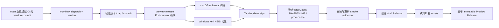

# 安装、更新与开源发布策略

> 状态：v1 实施基线
>
> 日期：2026-07-28
>
> 产品：QuotaTide (`dev.theblind.quotatide`)
>
> 关联：[发布链路研究](./release-pipeline.md) ·
> [应用架构](./application-architecture.md) ·
> [配置与安全模型](./config-state-security.md)

## 结论

v1 是通过 GitHub Releases 直接分发的 `0.x` 未签名预览版：

- macOS 发布一个 universal DMG，同时支持 Apple Silicon 与 Intel；
- Windows 发布一个 x64 per-user NSIS `setup.exe`；
- 不进入 Mac App Store、Microsoft Store，不发布 MSI，不自建 update server
  或 CDN；
- 当前不购买 Apple Developer ID 或 Windows Authenticode 证书，因此用户会
  看到 Gatekeeper/SmartScreen 未知发布者提示；
- Tauri updater signature 与 SHA-256 校验仍强制启用，未签名不等于允许
  未验证更新；
- GitHub `/releases/latest/` 提供静态 `latest.json`，应用默认每天检查，
  但只有用户确认后才下载、安装并重启；
- 已发布版本不可覆盖或自动降级，故障以更高 patch 版本向前修复；
- v1 允许单维护者发布例外，贡献者代码与发布秘密严格隔离。

## 支持矩阵

| 平台 | Rust target / bundle | v1 状态 |
|---|---|---|
| macOS Apple Silicon | `universal-apple-darwin` 中的 arm64 slice | 正式支持 |
| macOS Intel | `universal-apple-darwin` 中的 x86_64 slice | 正式支持 |
| Windows x64 | `x86_64-pc-windows-msvc`, NSIS | 正式支持 |
| Windows ARM64 | `aarch64-pc-windows-msvc` | 不承诺，后续验证 |
| Linux / mobile / web | — | 不在范围 |

“正式支持”表示每次发布都必须构建、运行自动测试、完成安装/更新 smoke test，
并在兼容性问题出现时持续维护。能偶然编译不等于进入支持矩阵。
具体最低版本与阻断 QA 为 macOS 15 Sequoia universal、Windows 11 25H2 x64，
见[最低系统版本与发布 QA 门禁](./minimum-os-and-release-qa.md)；扩大兼容
smoke 不能自动扩大本表的正式承诺。

### macOS 产物

同一个 universal app 生成：

```text
QuotaTide_<version>_universal.dmg
QuotaTide.app.tar.gz
QuotaTide.app.tar.gz.sig
```

当前没有 Developer ID 时，可以按 Tauri/macOS 构建要求使用 ad-hoc code
signature，但发布说明必须把它视为**没有受信发布者身份、没有 Apple 公证**
的构建。不得使用“已签名”描述 ad-hoc bundle。

### Windows 产物

```text
QuotaTide_<version>_x64-setup.exe
QuotaTide_<version>_x64-setup.exe.sig
```

NSIS 使用 per-user 模式，默认安装到 `%LOCALAPPDATA%`，不要求管理员权限。
WebView2 使用 `embedBootstrapper`，不捆绑 fixed runtime。MSI、per-machine
安装和企业软件分发不属于 v1。

## 未签名预览版边界

“开源”不会让操作系统自动信任 binary。Release 页面与 README 下载区域必须
在安装按钮附近明确说明：

- macOS 没有 Developer ID/notarization，Gatekeeper 可能阻止首次启动；
- Windows 没有 Authenticode，SmartScreen 会显示 Unknown publisher；
- 用户应只从项目正式 GitHub Release 下载，并核对文件名、SHA-256 和
  GitHub provenance；
- 项目不会要求用户全局关闭 Gatekeeper、SmartScreen、Smart App Control、
  antivirus 或系统证书验证。

允许提供操作系统自身的单应用例外说明：

- macOS 只描述 Finder 的 Control-click/Open 或 System Settings 中针对该应用
  的 Open Anyway（以当前系统实际 UI 为准）；
- Windows 只描述 SmartScreen 当前页面中的单次确认路径；
- 不提供 `spctl --master-disable`、注册表全局关闭、全盘 `xattr` 清理或类似
  降低整个设备安全性的命令。

Release notes 还要给出校验命令：

```text
macOS:   shasum -a 256 <file>
Windows: Get-FileHash <file> -Algorithm SHA256
```

未签名预览版不能宣称“系统已验证发布者”。平台信任 seam 仍保留：未来获得
证书后，macOS 增加 Developer ID + hardened runtime + notarize/staple，
Windows 通过 Tauri `signCommand` 增加 Authenticode。届时必须遵守
[发布链路研究](./release-pipeline.md) 已验证的“OS signing 在前、Tauri
updater signing 在后”顺序。

## 版本与 Release channel

首个公开版本是 `0.1.0`。版本唯一来源为
`src-tauri/tauri.conf.json > version`，release workflow 验证 Rust/frontend
package version 和 tag 与它一致。

规则：

```text
普通预览版: 0.MINOR.PATCH
候选测试版: 0.MINOR.PATCH-rc.N
稳定版:     1.0.0 及以后（由未来稳定门槛决定）
```

- 面向 updater 的 `0.x` 预览版是 GitHub 普通 Release，标题和正文明确写
  `Preview / 预览版`，不勾选 GitHub prerelease；
- `-rc.N` 只供手动测试，勾选 prerelease，不进入 `/releases/latest/`；
- tag 固定为 `v${version}`，发布后不移动或复用；
- v1 只有一个 stable updater channel，不实现 beta channel selector。

把预览版发布成普通 Release 是为了让静态
`/releases/latest/download/latest.json` 有确定语义，不表示产品已经达到
`1.0` 稳定承诺。

## updater 契约

### 发现新版本

应用只访问：

```text
https://github.com/<owner>/<repo>/releases/latest/download/latest.json
```

`latest.json` 至少包含：

```text
version
notes
pub_date
platforms.darwin-aarch64 { url, signature }
platforms.darwin-x86_64  { url, signature }
platforms.windows-x86_64 { url, signature }
```

两个 macOS platform key 指向同一个 universal updater archive/signature。
`signature` 是 `.sig` 文件内容，不是 URL。

检查节奏：

1. 应用启动稳定 60 秒后检查一次；
2. 之后每 24 小时检查一次；
3. 用户可以手动检查；
4. 设置中可以关闭自动检查，手动检查仍可用；
5. 睡眠期间不补跑每个周期，唤醒后只运行一次过期检查。

更新请求不携带 Codex token、Account ID、额度、邮箱、设备标识或其他用户
数据。GitHub 只会收到普通 HTTPS 请求所需的网络信息。

### 验证与安装

- Tauri updater signature 强制启用，不能通过配置关闭；
- public key 编译进应用，WebView 无 updater/plugin-process 通用权限；
- Rust adapter 解析 manifest、比较 SemVer、下载并验证 exact artifact bytes；
- 只有远端版本更高、platform entry 完整、HTTPS URL 合法且 signature
  验证通过时才显示更新；
- UI 展示版本、release notes 和“安装并重启”；
- 用户点击后才下载/安装，不预下载、不静默安装、不强制重启；
- signature、hash、URL、schema 或安装失败只显示脱敏错误，继续运行当前版。

### updater key 保管

生成密码保护的 Tauri updater key：

```text
仓库:
  public key
  public key fingerprint

GitHub preview-release Environment secrets:
  TAURI_SIGNING_PRIVATE_KEY
  TAURI_SIGNING_PRIVATE_KEY_PASSWORD

离线:
  两份相互独立的加密恢复副本
```

private key/password 永不进入 Git、安装包、日志、workflow artifact 或 fork
PR。两份离线副本在首个 Release 前做一次恢复演练，确认能对测试 artifact
产生与仓库 public key 匹配的 signature。

正常轮换使用 bridge release：

1. 仍由旧 private key 发布内嵌新 public key 的版本；
2. 等待采用并保留恢复窗口；
3. 后续版本才改用新 private key；
4. 丢失旧 key 时不能声称现有客户端仍可自动更新。

## roll-forward 与安全事件

GitHub Release 启用 immutability。发布前可以删除或重建 draft；publish 后：

- tag、installer、updater archive、`.sig`、`latest.json` 和 checksum 不覆盖；
- 不让静态 updater 安装低版本；
- 故障时从已知良好 commit 恢复代码，以更高 patch 完整重建并发布；
- release notes 标出 superseded/bad version；
- 旧安装包保留供知情用户手动恢复，但不会重新成为 `latest`。

示例：

```text
0.2.1 有严重缺陷
  -> 从 0.2.0 的代码修复
  -> 发布 0.2.2
  -> 0.2.1 客户端正常升级到 0.2.2
```

updater private key 泄露时：

1. 立即停止发布并撤销有权读取 secret 的 GitHub access；
2. 删除未发布 draft，保全审计记录；
3. 发布安全公告，说明已安装版本的风险；
4. 如果旧 key 仍可受控使用，发 bridge release；否则自动更新信任链无法静默
   修复，需要发布新的手动安装信任根；
5. 不能只替换同版本 `.sig` 或 `latest.json`。

## GitHub Actions

### `ci.yml`

触发：`pull_request`、`push` 到 `main`。

```text
Linux:
  format, clippy, core/unit/integration, UI lint/typecheck/test

macOS:
  universal/ad-hoc bundle build, platform adapter tests

Windows:
  x64 NSIS build, platform adapter tests
```

规则：

- 顶层 `permissions: {}`，需要 checkout 的 job 只给 `contents: read`；
- fork 使用 `pull_request`，不使用 `pull_request_target` 执行 fork 代码；
- CI 不读取 updater private key，不创建 Release；
- public repository 使用 ephemeral GitHub-hosted runner，不让不可信 PR 运行在
  self-hosted release machine；
- actions 固定到完整 commit SHA，升级通过受审 PR。

### `release.yml`

v1 使用单维护者可执行的受控流程：



- 入口只能是 `workflow_dispatch`；输入版本必须与 main 上配置一致；
- workflow 创建 annotated `vX.Y.Z` tag，或验证由受保护 release 角色创建的
  同名 tag；
- `preview-release` Environment 保存 updater key，单维护者阶段允许自审，
  但必须产生人工确认与审计记录；
- 只有最终 publish job 有 `contents: write`；
- provenance job 单独拥有 `id-token: write` 和 `attestations: write`；
- build jobs 默认 `contents: read`，不直接写 Release；
- release concurrency 不自动取消正在构建/签名的发布；
- 获得平台证书后新增 `platform-signing` Environment，不与 updater key 或
  publish 权限混成一个共享 secret。

## Release 资产

每个普通 `0.x` Preview Release 必须一次性包含：

```text
macOS universal DMG
macOS universal updater .app.tar.gz
macOS updater .sig
Windows x64 NSIS setup.exe
Windows updater .sig
latest.json
SHA256SUMS
release notes / known issues / unsigned warning
GitHub artifact attestations
```

Release source archive 由 GitHub 自动提供。所有 manifest URL 必须指向同一
tag 的 immutable assets；发布前验证下载 URL、content length、SHA-256 和
Tauri signature。任一 platform artifact 缺失时不能只发布另一平台的
`latest.json`，应修复整次 draft。

## 权限与开源贡献

### 单维护者阶段

| 角色 | 权限 |
|---|---|
| Contributor | fork/PR；只读 CI；无 secret、tag、Release 权限 |
| Maintainer/Publisher | 合并、准备 version commit、确认 Environment、发布 |
| GitHub Actions | job 级最小权限；只有 publish job 可写 Release |

保护：

- `main` 必须通过 required CI，禁止直接 force-push；
- `v*` tag 禁止普通 contributor 创建或移动；
- updater private key 只在 `preview-release` Environment；
- workflow、release scripts、Tauri config/updater public key、lockfiles 使用
  CODEOWNERS；
- Dependabot/fork PR 不能触发带 secret 的 workflow；
- 每次 release checklist 记录单维护者例外。

新增第二位可信维护者后：

- `preview-release` 和未来 `platform-signing` 启用 required reviewer；
- 开启 prevent self-review；
- 触发者、签名审批者和 publish 审批者至少由两人覆盖；
- updater 离线备份交由两位维护者分别保管。

## 首次发布前 gate

首次 `0.1.0` 之前必须具备：

1. 最终产品名、bundle identifier、GitHub `<owner>/<repo>` 和 updater
   endpoint；
2. macOS/Windows 图标与 tray assets；
3. updater key、fingerprint、GitHub Environment 和两份恢复副本；
4. protected main/tag、CODEOWNERS、secret-free fork CI；
5. universal macOS 与 x64 Windows installer 可重复构建；
6. 两个平台从旧测试版本到 `0.1.0` 的真实 updater smoke；
7. clean-machine install/launch/tray/configure/notify/update/uninstall smoke；
8. `latest.json` schema、URL、signature、SHA256SUMS 和 attestation 验证；
9. README/Release 中紧邻下载位置的未签名风险说明；
10. MIT LICENSE、SECURITY.md、隐私/无遥测说明和第三方 notices。

缺少平台证书不会阻止**预览版** gate，但必须保持显著未签名标识。以后对某一
平台启用正式签名时，要同时更新发布说明与 smoke gate，不能继续把已签名资产
描述为未签名，也不能让同一 Release 混入来源不明的替代包。

## 必须验证的场景

1. fork PR 无法读取或间接打印 updater secrets。
2. 非 main commit、版本不一致或 CI 未通过时 release workflow 失败。
3. private key 未配置时不能发布没有 `.sig` 的 updater asset。
4. macOS 两个 architecture keys 指向同一已验证 universal archive。
5. Windows manifest 只包含 x64，不宣称 ARM64。
6. GitHub prerelease 不会替代普通 Preview Release 的 `latest.json`。
7. 自动检查关闭时不发网络请求，手动检查仍可用。
8. manifest 非 HTTPS、跨 host redirect、缺字段或签名错误时拒绝更新。
9. 用户取消安装后保持当前版本，不重复提示到骚扰程度。
10. 发布坏版本后只能以更高 SemVer roll-forward。
11. updater key 从两份离线备份均能恢复并通过 public key 验证。
12. Release assets 发布后不可替换，checksum 与 attestation 可独立验证。
13. 未签名安装指引不包含全局关闭系统安全的命令。

## 后续升级边界

以下变化需要新的发行决策，不应作为 v1 隐式能力：

- Windows ARM64 或 MSI；
- Mac App Store / Microsoft Store；
- Developer ID/notarization 或 Windows Authenticode 的正式启用与所有权；
- beta/nightly updater channel；
- staged rollout、强制更新、动态 update server 或自动降级；
- 多维护者正式 release quorum；
- 自建 CDN、下载统计、遥测或崩溃上报。

此策略固定的是 v1 未签名预览版。平台签名研究仍保留为未来升级依据，但当前
implementation 和首次开源 Release 不依赖付费证书或平台开发者账号。
