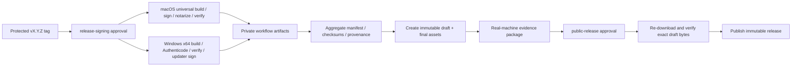

# macOS / Windows 发布与更新链路研究

> 调研日期：2026-07-28
>
> 状态：供“决定安装、更新与开源发布策略”使用的研究基线

## 摘要

Tauri 2 可以用 GitHub Actions 构建 macOS 与 Windows 安装包，并以 GitHub
Releases 承载下载和静态 updater manifest。代码、测试、无签名开发包、
Tauri updater 密钥和公开仓库的标准 GitHub-hosted runners 都不要求购买
证书；面向普通用户直接分发时，macOS 和 Windows 的操作系统信任链需要额外
身份与成本。

推荐后续策略票以此为基线：

- macOS 直接分发一个 Developer ID 签名、公证并 stapled 的 universal DMG；
- Windows 直接分发一个当前用户安装的 x64 NSIS `setup.exe`；签名主体符合
  地域条件时使用 Azure Artifact Signing Public Trust，否则使用受信任 CA
  的 OV certificate + hardware/cloud HSM；
- GitHub Release 同时保存安装包、Tauri updater 包/签名、`latest.json`、
  SHA-256 checksums 和构建 provenance；
- 应用自动检查更新，但由用户确认后安装；v1 只设 stable channel；
- 静态 updater 不启用降级。事故时回退代码并发布更高 patch 版本；
- fork PR 永远不接触发布凭证。签名和发布分别由受保护 GitHub Environment
  审批，最终 Release 启用 immutability。

这是一条 direct-download 路线，不依赖 App Store、Microsoft Store、自建
更新服务器、CDN 或遥测后台。

## 已验证的平台事实

### macOS

Apple 将开发与面向公众的直接分发区分开：

- 免费 Apple Account 可用于开发和测试；Developer ID 与 notarization 属于
  Apple Developer Program。Apple 当前列出的会员价格是每年 99 USD，符合
  条件的非营利、教育或政府实体可能获减免。
  [Apple membership comparison](https://developer.apple.com/support/compare-memberships/)
- Mac App Store 之外的软件使用 `Developer ID Application` 签名并提交 Apple
  公证。Apple 说明 Developer ID + notarization ticket 让 Gatekeeper 验证
  发布身份、完整性和已知恶意内容。
  [Developer ID certificates](https://developer.apple.com/help/account/certificates/create-developer-id-certificates/)
- 直接分发的新软件需要 hardened runtime、secure timestamp、合法
  Developer ID 签名，并通过 `notarytool`/Notary API 公证；`altool` 已停止
  接受提交。公证不是 App Review。
  [Notarizing macOS software](https://developer.apple.com/documentation/security/notarizing-macos-software-before-distribution)
- Tauri 在 CI 中支持导入 Developer ID `.p12`，并支持使用 App Store Connect
  API key 或 Apple ID 凭证完成公证。免费账号不能完成 notarization。
  [Tauri macOS signing](https://v2.tauri.app/distribute/sign/macos/)
- Tauri CLI 的 `universal-apple-darwin` 会组合 Intel 与 Apple Silicon target；
  构建机必须安装两个 Rust targets。
  [Tauri CLI](https://v2.tauri.app/reference/cli/)

因此，开发期可使用 unsigned/ad-hoc build，但 GitHub Release 的正式 macOS
资产必须来自付费团队的 Developer ID。Ad-hoc 签名只能避免部分 Apple Silicon
“损坏”表现，不能替代 Developer ID、notarization 或 Gatekeeper 信任。

CI 优先使用 App Store Connect **Team API key** 完成 notarization，避免保存
Apple Account password。Individual API key 不能用于 `notarytool`；Team key
作用于整个团队且不能限制到单一 app，`.p8` 只能下载一次，因此必须作为高价值
发布凭证离线备份并放入受保护 environment。
[Creating App Store Connect API keys](https://developer.apple.com/documentation/appstoreconnectapi/creating-api-keys-for-app-store-connect-api)

#### 正式 macOS 产物

推荐同一 universal app 生成：

```text
<app>_<version>_universal.dmg       # 用户手动安装
<app>.app.tar.gz                    # Tauri updater
<app>.app.tar.gz.sig                # Tauri updater signature
```

DMG 是 Tauri 官方支持的直接分发形式。updater 使用已签名 app bundle 的
`.tar.gz`，不能拿未经 Developer ID 签名的另一份 binary 替换。

#### macOS 发布 gate

CI 必须在上传前执行：

```text
codesign -vvv --deep --strict <app>.app
spctl -vvv --assess --type exec <app>.app
xcrun stapler validate <app>.app
```

Apple 官方故障排查文档明确推荐 `codesign --deep --strict` 和 `spctl --assess`
验证，并要求 secure timestamp、hardened runtime 与无
`com.apple.security.get-task-allow` 的发布 entitlements。
[Apple notarization checks](https://developer.apple.com/documentation/security/resolving-common-notarization-issues)

此外要在与最低支持版本匹配的 Intel/Apple Silicon 真机或 VM 中各完成一次
安装、首次启动、托盘、通知、凭证库、开机启动、更新和卸载 smoke test。

### Windows

Windows 可以运行未签名桌面应用，但直接从浏览器下载时会遇到 SmartScreen/
Smart App Control 信任问题：

- Tauri 可生成 WiX `.msi` 或 NSIS `setup.exe`。NSIS 默认按当前用户安装，
  不要求管理员权限；默认位置是 `%LOCALAPPDATA%`。
  [Tauri Windows installer](https://v2.tauri.app/distribute/windows-installer/)
- Microsoft 说明 Smart App Control 默认阻止未知、未签名代码；受 Microsoft
  Root Program 信任的 CA 证书可以提供签名信任。
  [Smart App Control overview](https://learn.microsoft.com/en-us/windows/apps/develop/smart-app-control/overview)
- Microsoft 当前推荐 direct-download 应用使用 Azure Artifact Signing
  Public Trust。官方 SmartScreen 文档同时说明 EV 证书不再自动绕过
  SmartScreen，因此不能仅为旧有“即时信誉”说法支付 EV 溢价。
  [SmartScreen reputation](https://learn.microsoft.com/en-us/windows/apps/package-and-deploy/smartscreen-reputation)
- Artifact Signing Public Trust 面向公开分享的 Win32/Authenticode 软件，需要
  identity validation；证书生命周期由 Azure 托管。
  [Artifact Signing trust models](https://learn.microsoft.com/en-us/azure/artifact-signing/concept-trust-models)
- Public Trust 当前只面向美国、加拿大、欧盟、英国的组织，以及美国、加拿大
  的个人开发者；它也不支持 free/trial/sponsored Azure subscription。最终
  法律签名主体若不在这些范围内，就不能采用此路线。由此可知，如果最终签名
  主体是中国注册的个人或组织，按当前规则不能使用 Public Trust。
  [Artifact Signing FAQ](https://learn.microsoft.com/en-us/azure/artifact-signing/faq)
- Microsoft 当前 SmartScreen 文档给出的 Artifact Signing 典型成本约为
  10 USD/月；实际价格受地区、协议和计费账户影响，应以 Azure pricing
  calculator 为准。
  [SmartScreen reputation](https://learn.microsoft.com/en-us/windows/apps/package-and-deploy/smartscreen-reputation) ·
  [Artifact Signing pricing](https://azure.microsoft.com/en-us/pricing/details/trusted-signing/)

如果维护主体不能通过 Azure Public Trust 身份/地域验证，正式路线必须购买
受信任 CA 的 OV Authenticode certificate。Microsoft 当前给出的典型区间是
150–300 USD/年；自 2023-06 起，OV private key 需要位于合规 hardware token
或 HSM，不能假定可以把普通 `.pfx` 放进 GitHub secret。实施时应选择能从
GitHub-hosted runner 调用的 CA cloud-HSM signer；自签名证书与不签名对普通
用户没有等价信任价值。
[Windows code-signing options](https://learn.microsoft.com/en-us/windows/apps/package-and-deploy/code-signing-options)

无论选择 Artifact Signing、OV 还是 EV，Microsoft 当前都不保证新文件首次
下载不会出现 SmartScreen。EV 自 2024 年起也不再即时绕过 reputation；应保持
稳定 publisher identity 并把初期提示视为发布风险，而不是签名失败。

#### Windows 安装包选择输入

NSIS 更适合本产品的 consumer tray app：

- 当前用户安装默认不提权；
- 同一 `setup.exe` 可同时作为手动安装包和 Tauri v2 updater 包；
- 多语言与自定义安装行为由 Tauri 官方 bundler 支持；
- MSI 可作为未来企业部署附加产物，但不是 v1 用户安装的必要条件。

推荐使用 `embedBootstrapper` WebView2 模式：相对默认增加约 1.8 MiB，并在
系统缺少 WebView2 时运行 bootstrapper。Windows 10/11 通常已随系统提供
WebView2；不应捆绑约 180 MiB 的 fixed runtime。
[Tauri WebView2 modes](https://v2.tauri.app/distribute/windows-installer/)

#### Windows 签名顺序

操作系统 Authenticode 会修改文件字节，而 Tauri updater signature 校验最终
installer。安装后的 app executable 也会被 Smart App Control 检查，不能只签
最外层 installer。正确顺序必须是：

```text
compile app.exe
  -> Authenticode sign app.exe + RFC 3161 timestamp
  -> bundle NSIS and sign generated executable/uninstaller/installer
  -> verify every PE and final installer
  -> Tauri signer sign(final setup.exe)
  -> write latest.json
```

不能先生成 `.sig` 再对 `setup.exe` 做 Authenticode，否则 updater signature
会失效。Tauri 当前源码也是先完成 bundling/Authenticode，再把最终 installer
path 交给 updater signer；Tauri CLI 另提供 `tauri signer sign <FILE>`，其
key 参数也可由 `TAURI_SIGNING_PRIVATE_KEY` 注入。
[Tauri bundle then updater-sign](https://github.com/tauri-apps/tauri/blob/5a882eccfda53a189ec076c79c4ad186f50db5ff/crates/tauri-cli/src/bundle.rs#L230-L232) ·
[Tauri updater signs returned bundle paths](https://github.com/tauri-apps/tauri/blob/5a882eccfda53a189ec076c79c4ad186f50db5ff/crates/tauri-cli/src/bundle.rs#L308-L320) ·
[Tauri signer CLI](https://v2.tauri.app/reference/cli/)

Artifact Signing 可用时，在 Windows GitHub-hosted runner 上使用 GitHub
OIDC / Microsoft Entra federated credential。workflow 只保存 Azure
tenant/client/subscription IDs，不保存 Azure client secret；被授予的身份只需
`Artifact Signing Certificate Profile Signer` role。官方
[`azure/artifact-signing-action`](https://github.com/Azure/artifact-signing-action)
证明 Windows 2022/2025 runner 与 OIDC 路径受支持，但它当前不支持 Windows
Arm runner。

正式 Tauri pipeline 需要让 bundler 的 `signCommand` 调到所选 signer，以覆盖
app executable、NSIS 生成内容和 installer。Artifact Signing 路线优先用一个
受控 PowerShell wrapper 调用 Microsoft SignTool + Artifact Signing Dlib；
OV 路线由同一 seam 调用 CA 的 cloud-HSM tool。Tauri 文档还给出第三方
`artifact-signing-cli` 示例，但它不能替代一次真实端到端原型。无论采用哪条
路径，都必须证明所有 PE 已 Authenticode 签名，且 Tauri updater signature
最后生成。
[Tauri Windows signing](https://v2.tauri.app/distribute/sign/windows/)

Windows gate 至少包括：

```text
Get-AuthenticodeSignature <app>-setup.exe == Valid
signtool verify /pa /all /v <app>-setup.exe
Tauri updater public key verifies <app>-setup.exe.sig
clean VM install -> launch -> update -> uninstall
```

新签名使用 SHA-256 和 RFC 3161 timestamp；Microsoft 不建议新发布使用 SHA-1。
[Microsoft Authenticode timestamping](https://learn.microsoft.com/en-us/windows/win32/seccrypto/time-stamping-authenticode-signatures)

## Tauri updater

### 两套签名不能混为一谈

每个平台正式包同时需要：

1. **OS identity signature**：Developer ID 或 Authenticode，供 Gatekeeper/
   Windows 信任发布者。
2. **Tauri updater signature**：独立公私钥，供已安装应用验证更新 artifact。

Tauri updater signature 强制启用，不能关闭。public key 编译进
`tauri.conf.json`；private key 仅在受保护发布 job 中出现。Tauri 明确警告：
private key 丢失后，已经安装的客户端无法再接收后续更新。
[Tauri updater signing](https://v2.tauri.app/plugin/updater/)

应生成一个密码保护的 updater key，并保存：

- GitHub `release-signing` environment secret：供 CI 使用；
- 两份离线加密恢复副本：由不同维护者保管；
- 仓库只提交 public key 和 fingerprint。

常规轮换必须先用旧 key 发布一个嵌入新 public key 的 bridge release，确认
采用率后再用新 private key 发布。不得把“删除 GitHub secret 后重新生成”
当作轮换方案。

### 静态 GitHub Release endpoint

v1 无需动态更新服务器。Tauri 支持：

```text
https://github.com/<owner>/<repo>/releases/latest/download/latest.json
```

`latest.json` 至少包含 SemVer、各 `OS-ARCH` 的 URL 和 `.sig` 内容。macOS
universal 包可让 `darwin-aarch64` 与 `darwin-x86_64` 指向同一 URL/signature；
Windows v1 提供 `windows-x86_64`。

Tauri 官方文档说明静态 manifest 会先验证所有平台条目，再比较版本，因此
发布前必须检查 manifest 中每个 URL 都存在、signature 内容不是路径、所有
平台完整。生产 updater endpoint 强制 HTTPS。
[Tauri static updater JSON](https://v2.tauri.app/plugin/updater/)

建议应用由 Rust 在以下时机检查：

- 启动稳定 60 秒后；
- 之后每 24 小时一次；
- 用户在“关于/更新”里手动检查。

发现更新后显示版本、release notes 和“安装并重启”，由用户确认后下载、验证
并安装。v1 不静默强制更新，不让 WebView 获得 updater/plugin-process 通用
权限；Rust adapter 完成 check/download/install/relaunch。

### 回滚

静态 updater 默认按 SemVer 选择更高版本，且 immutable GitHub Release 的
asset 不能被替换。Tauri 只有动态服务器配合自定义 version comparison 才能
主动安装低版本。
[Tauri dynamic updater rollback](https://v2.tauri.app/plugin/updater/)

v1 不承担动态服务和降级攻击面，采用 roll-forward：

1. 停止继续推广有问题的版本；
2. 从已知良好 commit 回退代码；
3. 以更高 patch 版本重新构建、重新签名、公证并发布；
4. 在 release notes 标注 supersedes/bad-version；
5. 若更新程序自身损坏，保留以前安装包供手动恢复，并发布更高版本修复。

如果发现签名凭证泄漏，应同时撤销平台证书/云权限、删除受影响 release（必要
时）、轮换可轮换凭证并发布安全公告；仅把 `latest.json` 指回旧文件不足以让
已安装客户端降级。

## GitHub Actions 与 Releases

### 成本与托管

- 公开仓库使用 standard GitHub-hosted runners 免费；private 阶段受账号
  minutes/storage quota 约束。
  [GitHub Actions billing](https://docs.github.com/en/billing/concepts/product-billing/github-actions)
- GitHub Release 单个 asset 上限 2 GiB、每个 release 最多 1000 assets，
  当前无总大小和带宽上限，足够承载本应用。
  [GitHub Releases](https://docs.github.com/en/repositories/releasing-projects-on-github/about-releases)
- Tauri 官方提供 GitHub Actions 示例和 `tauri-action`，能构建并上传多平台
  artifact，也能生成 updater JSON。
  [Tauri GitHub pipeline](https://v2.tauri.app/distribute/pipelines/github/)

本项目仍推荐自己聚合 `latest.json`，而不是让每个 matrix job 直接写 Release：
这样只有最终 publish job 获得 `contents: write`，并能在发布前验证跨平台
artifact 完整性。

### 两条 workflow

#### `ci.yml`：无秘密

触发：`pull_request`、`push` 到 `main`。

```text
Linux: format + lint + core/unit/integration + UI tests
macOS: unsigned/ad-hoc build + platform tests
Windows: unsigned build + platform tests
```

- 顶层 `permissions: {}`，checkout job 只给 `contents: read`。
- fork PR 使用普通 `pull_request`，不使用 `pull_request_target`。
- 不读取 environment secrets、不签名、不公证、不发布。
- GitHub 默认不向 fork PR 传递 Actions secrets；不要用 privileged workflow
  checkout 并执行 fork 代码。
  [GitHub fork secret model](https://docs.github.com/en/code-security/reference/secret-security/secret-types)

#### `release.yml`：受保护

入口是 main 上的 version PR 合并后创建 `vMAJOR.MINOR.PATCH` tag。workflow
首先验证：

- tag commit 位于受保护 `main`；
- tag 与 `tauri.conf.json` 的唯一版本一致；
- Cargo/npm lockfiles 已提交且工作区生成物无 diff；
- 同 commit 的 required CI 全绿；
- stable release 不含 SemVer prerelease/build metadata。

发布分为：



- `concurrency: release` 且不自动取消正在签名的发布。
- `release-signing` environment 保护 Apple 与 Tauri key；Windows 在 Azure
  可用时通过 OIDC 获得短期 token，否则只向 CA cloud-HSM adapter 提供最小
  短期凭证。
- `public-release` environment 要求另一位 reviewer，启用
  prevent self-review；只有创建 draft 的聚合 job 与最终 publish job 有
  `contents: write`，构建 job 均为只读。
- GitHub Environment 在公开仓库可提供 required reviewers、branch/tag
  restrictions 和审批后才可访问的 secrets。
  [GitHub deployment environments](https://docs.github.com/en/actions/reference/workflows-and-actions/deployments-and-environments)
- workflow 顶层拒绝权限，每个 job 单独给最小权限。创建 Release 只需
  `contents: write`；Artifact Signing/attestation job 才给 `id-token: write`。
  [GitHub workflow permissions](https://docs.github.com/en/actions/reference/workflows-and-actions/workflow-syntax)

发布 workflow 使用的所有 action 固定到完整 commit SHA，由 Dependabot 提出
升级 PR。GitHub 明确指出 tag 可移动，full SHA 才固定到已审查代码。
[GitHub Actions hardening](https://docs.github.com/en/code-security/tutorials/secure-your-organization/protect-against-threats)

### Release 资产与不可变性

每个 stable Release 至少有：

```text
macOS DMG
macOS updater tar.gz + .sig
Windows NSIS setup.exe + .sig
latest.json
SHA256SUMS
release notes / known issues
build provenance attestations
```

公开仓库可用 GitHub artifact attestations 把 artifact 绑定到 repository、
workflow、commit SHA 和 environment；消费者可用 `gh attestation verify`
验证。生成 binary attestation 的 job 需要 `id-token: write`、
`contents: read` 和 `attestations: write`。
[GitHub artifact attestations](https://docs.github.com/en/actions/how-tos/secure-your-work/use-artifact-attestations/use-artifact-attestations)

启用 GitHub Release immutability。流程先创建 draft、一次性上传并核对所有
assets，再 publish；发布后 tag 和 assets 不允许被移动、替换或单独删除，
同时 GitHub 生成 release attestation。
[GitHub immutable releases](https://docs.github.com/en/code-security/concepts/supply-chain-security/immutable-releases)

## 发布权限模型

### 角色

| 角色 | 权限 |
|---|---|
| Contributor | fork PR、无 secrets、无 tag/release 权限 |
| Maintainer | 合并代码、准备 version PR；不能单独完成生产发布 |
| Release manager | 审批 `release-signing`，检查版本与 CI |
| Publisher | 审批 `public-release`，不能与触发者是同一人 |
| Apple Account Holder/Admin | 创建/轮换 Developer ID 与最小权限 API key |
| Azure identity admin | 配置 federated credential 与 Artifact Signing signer role |

小型项目若暂时只有一位维护者，GitHub 无法创造真正的双人审批。此时仍保留
两个 environment 和完整审计轨迹，但必须在发布清单中明确记录单人例外；新增
第二位可信维护者后立即启用 prevent self-review。

### CODEOWNERS 与敏感路径

以下路径要求 release owners review：

```text
.github/workflows/**
.github/actions/**
scripts/release/**
src-tauri/tauri.conf*
src-tauri/Entitlements.plist
Cargo.lock
package-lock.json
```

还应保护 tag pattern `v*`，只允许 release maintainers 创建；普通贡献者不能
直接修改 updater public key、签名命令或发布脚本后触发带秘密的 job。

## 免费与付费边界

| 能力 | 开发/开源可免费完成 | 正式 direct distribution |
|---|---|---|
| Rust/Tauri/Preact 构建 | 是 | 是 |
| 本机/CI unsigned build | 是 | 只作测试，不向普通用户发布 |
| GitHub public Actions | standard runners 免费 | standard runners 免费 |
| GitHub Releases/updater hosting | 是 | 是 |
| Tauri updater key | 本地免费生成 | 免费，但必须安全托管与备份 |
| macOS 签名/公证 | ad-hoc/本机测试 | Apple Developer Program，99 USD/年 |
| Windows 签名 | unsigned/self-signed 测试 | 地域符合时 Artifact Signing 约 10 USD/月；否则 OV CA 典型 150–300 USD/年及 HSM/cloud signer |
| 自建 update server/CDN | 不需要 | v1 不需要 |

价格是 2026-07-28 的官方公开信息，不是长期报价。实施发布前必须重新核对
Apple membership、Azure region/eligibility 和实际账单。

## 交给策略票决定的事项

一手资料已清除技术未知项，但“决定安装、更新与开源发布策略”仍需正式确认：

1. v1 是否接受 **macOS universal + Windows x64** 的支持矩阵，Windows ARM64
   是后续原生产物还是 v1 同期产物；
2. Windows 正式签名主体是否落在 Azure Artifact Signing Public Trust 的地域
   与 identity validation 范围；不能时选择哪家 OV CA/cloud-HSM；
3. 是否采用推荐的“自动检查、用户确认安装”，还是完全手动更新；
4. 是否把 MSI 作为 v1 的企业附加包；
5. 首次公开 release 前的产品名、bundle identifier、Windows publisher display
   name 和 signing ownership。

其中 1–4 属于既有策略票；第 5 项说明品牌/发布身份必须在首个签名 prerelease
之前确定，不能在发布后随意变化。

## 一手资料索引

逐条事实、源码控制流和未决条件保存在
[`release-pipeline-source-notes.md`](./release-pipeline-source-notes.md)，供实施
release workflow 和复核上游变化时使用。
