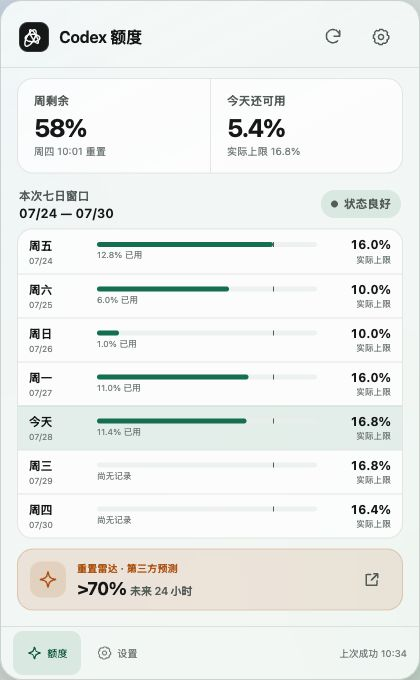
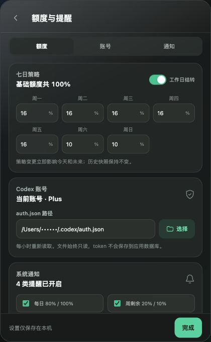
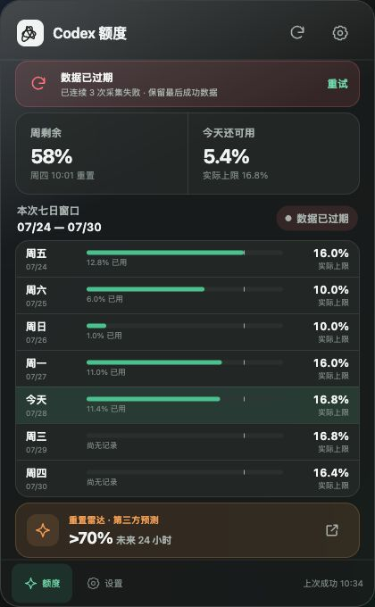
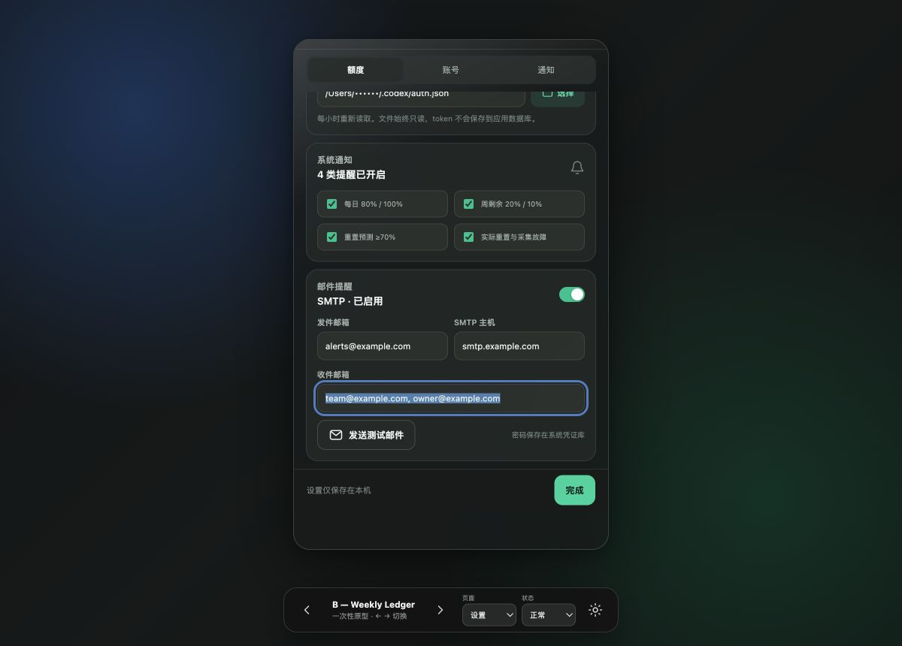
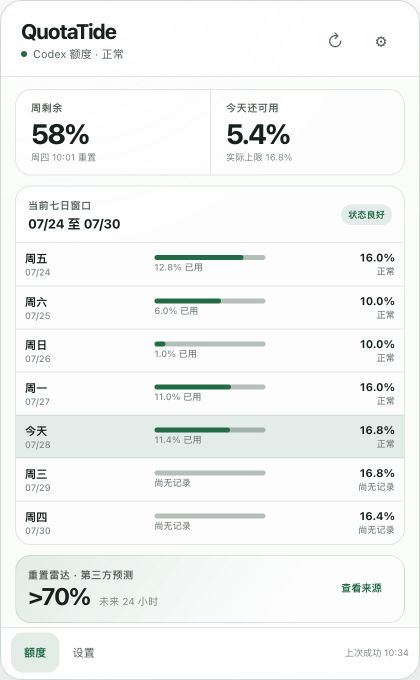
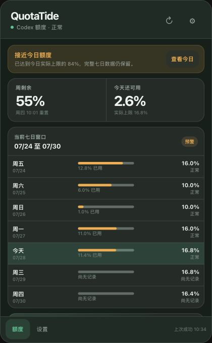

# 紧凑托盘窗口 UI 决策

日期：2026-07-28；2026-07-31 更新

## Verdict

选择 **C — Compact Telemetry** 作为桌面端 v1 的视觉方向，并保留 B 的七日
信息架构。

它把“当前账号本次额度窗口的七天”放在主视图中央，能同时回答三个最常见问题：

1. 本周还剩多少；
2. 今天还能用多少；
3. 本次额度窗口内每天用了多少、当天实际上限是多少。

默认态只显示周摘要、七日轨道与重置预测摘要；某天的使用、上限、可用和状态在
用户点击该天或“查看明细”后展开。这样保留 B 对当前账号七日策略的完整表达，同时
采用 C 的紧凑深色遥测感，避免把托盘弹层做成传统独立应用窗口。

当前实现原型位于 `ui/prototypes/quota-visual-directions/?variant=C`。下文保留的
B 截图与 commit 是 2026-07-28 的历史研究证据，不再代表当前视觉定稿。

## Primary source

- 一次性原型分支：`prototype/tray-window-ui`
- 原型 commit：`1d2a0ed9ef9dda0d30f0bc952f8d3c138d19becb`
- 启动命令（在该分支）：`npm run prototype:tray`
- 方案 URL：
  - `/?variant=A`
  - `/?variant=B`
  - `/?variant=C`
  - 可组合 `view=overview|settings`、`theme=light|dark`、
    `state=fresh|alert|stale|empty`

原型代码只保存在 throwaway 分支；main 不带 variants 和切换器。

## 截图

### 胜出方案：浅色概览

### 深色设置

### 深色过期状态

### 邮件配置与内部滚动

## 窗口与托盘行为

- 默认概览尺寸为 **360 × 430 logical pixels**；设置页和展开七日明细时增高至 602px。
- 窗口只有托盘弹层形态，不创建传统主窗口，不在 Dock/任务栏出现普通窗口项。
- 从托盘图标打开时，优先贴近图标并保持在可用屏幕内；靠近屏幕边缘时自动翻转。
- 点击窗口外或按 `Escape` 关闭弹层；打开文件选择器、系统权限窗口或 SMTP 测试结果时不误关。
- 再次点击托盘图标切换显示/隐藏。
- 默认概览尽量不滚动；七日轨道、雷达摘要与最后成功时间同时可见，展开明细时允许
  中间内容区短距离滚动。
- 设置内容内部滚动，顶部标题/返回和底部“完成”固定。
- 过期或告警条加入后，优先保留七天完整可见；必要时只有中间内容区产生短距离滚动，底部导航不被覆盖。
- 窗口文字放大到 125% 时允许中间内容滚动，不截断操作入口。

## 概览信息架构

从上到下固定为：

1. **标题栏**
   - 临时产品名；
   - 刷新；
   - 设置。
2. **高优先级状态条**
   - 只在预警、过期或错误时出现；
   - 同时显示图标、标题和一句行动说明，不能只靠颜色；
   - 错误时保留最后成功数据。
3. **两个主指标**
   - `周剩余`：当前 604800 秒 quota window 的剩余百分比；
   - `今天还可用`：今日实际上限减去今日已用。
4. **本周七日策略**
   - 标题显示窗口起止日期；
   - 固定七个紧凑日期单元，按窗口起始日至重置日前一天；
   - 默认只显示星期、日期与使用轨道，不直接铺开七天数字；
   - 点击一天后只展开该天的使用、上限、可用和文本状态；
   - 尚无记录显示空轨道，不伪造 0% 使用；
   - 今天使用强调背景，同时保留文本“今天”。
5. **重置雷达**
   - 显示计划生效时间、第三方分类置信度档位和外部来源入口；
   - 明确写“第三方信号、非 OpenAI 承诺”；
   - 不与账号确认重置合并。
6. **底部导航**
   - “额度”和“设置”两个入口；
   - 右侧固定最后成功时间；待配置时显示“尚未同步”。

刷新按钮遵守 30 秒冷却。刷新运行时只旋转刷新图标并保留原数据，不用整页 loading。

## 设置层级

设置是概览之上的第二层，返回后保留概览滚动与状态。顶部使用三段 segmented control：

1. **额度**
   - 七个自然日基础额度输入；
   - 实时显示合计；
   - 合计不得超过 100%，超出时在输入区内说明差值并阻止保存；
   - “工作日结转”独立开关；
   - 明确说明修改只影响今天与未来，历史快照不变。
2. **账号**
   - 脱敏展示当前账号与 plan；
   - 显示脱敏 `auth.json` 路径；
   - 文件选择按钮；
   - 选择后立即做只读验证，只显示公开错误码，不显示 token 或原始 JSON；
   - 强调每小时重新读取、文件永远只读。
3. **通知**
   - 系统通知总开关与四类提醒；
   - SMTP 发件邮箱、服务器、端口、TLS、用户名和密码；
   - SMTP 密码字段只表示“已保存/未保存”，不回填明文；
   - 多个收件邮箱使用可删除 token/chip，而不是逗号字符串作为最终实现；
   - 提供“发送测试邮件”，结果留在当前页；
   - 说明密码保存在 macOS Keychain / Windows Credential Manager。

编辑先保存在设置草稿中；“完成”统一校验并保存。关闭窗口前存在未保存修改时，下次打开继续保留草稿，不弹阻断式确认框。

## 空、错与提醒状态

### 待配置

- 主区只保留一个行动：“选择 auth.json”；
- 说明应用只读、每小时同步、token 不记录或上传；
- 不显示假的最后成功时间、周数据或雷达数据。

### 数据过期

- 顶部红色状态条显示连续失败次数和“重试”；
- 下方数据明确标记“数据已过期”，仍显示最后成功快照；
- “重试”仍受 single-flight 和 30 秒手动刷新冷却约束；
- 雷达若仍有效可独立展示；雷达过期则移除，不用账号错误代替。

### 预警/超额

- 顶部使用 amber/red 状态条；
- 今日行同时用文本状态和颜色；
- 预警只提供行动建议，不提供拦截、暂停或修改 Codex 的按钮。

### 系统通知入口

- 点击额度类通知打开概览并聚焦今日行；
- 点击预测通知打开概览并聚焦雷达；
- 点击配置/故障通知打开对应设置分类或错误条；
- 同一提醒事件在窗口、系统通知和邮件中共享同一个 dedup identity。

## 视觉系统

- 采用系统字体：macOS 使用 SF Pro，Windows 使用 Segoe UI；不下载 Web 字体。
- App 内容只使用一个绿色强调色；amber 只表示预测/预警，red 只表示错误/超额。
- 4/8px spacing rhythm，卡片圆角 14–16px，外窗圆角约 22px。
- 图标使用同一套 1.5–1.8px outline vector；原型 logo 只是占位，不是品牌决策。
- 毛玻璃来自原生窗口材质：
  - macOS 使用 vibrancy/visual effect；
  - Windows 优先 Acrylic，Windows 11 可降级 Mica；
  - 材质不可用时采用不透明 surface token。
- WebView 内卡片保持低透明度和细边界；允许绿色遥测脉冲与克制的边缘光，不使用
  大面积霓虹、装饰性粒子或高噪声背景。
- light/dark 都使用语义 token；系统主题变化时即时切换，不重启。
- 动效只用于窗口出现、刷新和状态变化，150–240ms；`prefers-reduced-motion` 或系统减少动态效果时关闭位移/旋转。

## 无障碍与键盘

- 可操作图标使用至少 44×44px hit area；内联桌面按钮至少 32px 高并保留清晰 focus ring。
- `Tab` 顺序与视觉顺序一致；所有 icon-only 按钮有可读名称。
- `Escape` 返回概览或关闭窗口；`Cmd/Ctrl+,` 打开设置；`Cmd/Ctrl+R` 手动刷新。
- 颜色不是唯一状态信号；所有状态都有文本和图标。
- 正文保持至少 4.5:1 对比度，次要大字/图标至少 3:1。
- 支持系统减少动态效果、高对比模式和键盘操作。

## Prototype validation

已在本地浏览器完成：

- 三种结构差异明显的方案可通过 URL、按钮和左右方向键切换；
- light/dark、overview/settings、fresh/alert/stale/empty 可组合；
- 360×460 定稿窗口无横向滚动；
- 正常与过期状态均保留七个日期单元；
- 设置区内部可滚动，底部保存操作固定；
- `auth.json` 路径脱敏，多收件邮箱可编辑；
- 页面无 console error/warning；
- `node --check`、现有 `npm run check` 和 23 个 Node 测试通过；
- `prefers-reduced-motion`、focus-visible、语义按钮/表单标签已加入原型。

真实 macOS vibrancy、Windows Acrylic/Mica、系统字体缩放、屏幕边缘定位和辅助技术仍必须在 Tauri 实现票中做两端真机验收；它们是实现 gate，不再是信息架构未知项。

## Ticket 15 implementation evidence

2026-07-29 曾在实际 Preact 实现中以固定 420×680 viewport 复验 B — Weekly
Ledger。该证据属于被 2026-07-31 C 方案取代前的历史基线；当前 360×460 紧凑轨道
需要以新的自动化与原生 smoke 结果为准。

